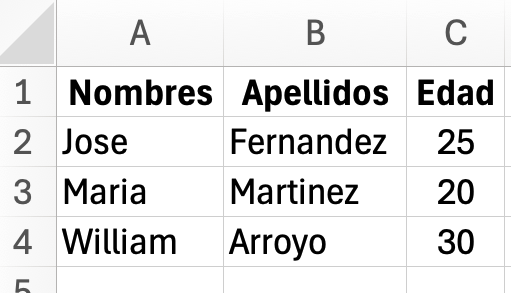
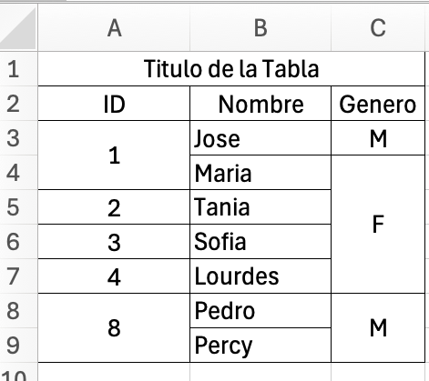

# LaTeXiS — Intelligent LaTeX Assistant for Spanish‑speaking Researchers (VS Code)

LaTeXiS is a VS Code extension designed to make LaTeX easier, faster, and more intuitive—especially for **Spanish‑speaking students, researchers, and thesis writers**.

**README language choice (why English here):** the extension UI/commands are Spanish‑first, but this README is written **English‑first** so it is easier to maintain, review, and publish internationally (Marketplace/GitHub). Examples and command titles remain in Spanish, and key notes are bilingual where it helps.

---

## What’s working today

✅ **Figures** (project‑aware insertion + automatic `graphicx` + `\graphicspath` management)

✅ **Equations** (menu of common math environments; correct LaTeX line breaks)

✅ **Tables**
- Clipboard (TSV) → clean `table` + `tabular` output
- Excel (`.xlsx`) → merges (multirow/multicolumn) + alignment

✅ **References**
- One‑shot BibLaTeX APA setup (auto‑creates `.bib` if missing)
- Change BibLaTeX citation style without duplicating blocks

---

## Key features

### 1) Figures (Insertar figura)
LaTeXiS inserts several figure layouts via a menu and makes the project compile‑safe.

**What it does**
- Detects the main TeX document (the one containing `\documentclass`).
- Ensures required packages (e.g. `graphicx`, plus `wrapfig`, `sidecap`, `subcaption`, `float` depending on the chosen layout).
- Ensures an image folder exists (creates `img/` if nothing is found and can copy an example image).
- Builds/updates a **single canonical** `\graphicspath{...}` in the main file.

**Command**
- **LaTeXiS: Insertar figura**

**Example output** (standard figure)
```tex
\begin{figure}[H]
  \centering
  \includegraphics[width=0.8\textwidth]{mi_imagen}
  \caption{Descripción de la figura}
  \label{fig:etiqueta}
\end{figure}
```

**Supported layouts**
- Figura estándar
- Figura compuesta (subfiguras)
- Figura a ancho completo (2 columnas)
- Imagen con texto alrededor (`wrapfigure`)
- Figura con caption lateral (`SCfigure`)
- Solo imagen (inline)

---

### 2) Equations (Insertar ecuación)
LaTeXiS provides a two‑level menu (category → template) and inserts common math environments.

**Important implementation detail (fixed):** environments that require line breaks (`align`, `cases`, `split`, `multline`, matrices) now correctly generate `\\` in the final `.tex`.

**Command**
- **LaTeXiS: Insertar ecuación**

**Example output** (`align*`)
```tex
\begin{align*}
  \nabla \cdot \vec{E} &= \frac{\rho}{\varepsilon_0} \\
  \nabla \cdot \vec{B} &= 0
\end{align*}
```

---

### 3) Tables (Pegar tabla simple / Insertar tabla desde archivo Excel)

#### 3.1 Simple tables from clipboard (TSV)
**Visual example (Excel → LaTeX)**

**Input (Excel – simple table copied to clipboard):**



**Output (LaTeX table generated by LaTeXiS):**

The table is automatically wrapped in a `table` environment, centered, with caption and label.

Paste a table copied from Excel/Google Sheets (tab‑separated text). LaTeXiS inserts a clean `table` + `tabular` with `booktabs`, caption on top, and a label.

**Command**
- **LaTeXiS: Pegar tabla simple**

**Example input**
Copy a range from Excel/Sheets (TSV).

**Example output**
```tex
% LaTeXiS: Tabla ingresada desde portapapeles
\begin{table}[H]
  \centering
  \caption{Descripción de la tabla}
  \label{tab:etiquetaTabla}
  \begin{tabular}{llr}
    \toprule
    Nombres & Apellidos & Edad \\
    \midrule
    Jose & Fernandez & 25 \\
    Maria & Martinez & 20 \\
    William & Arroyo & 30 \\
    \bottomrule
  \end{tabular}
\end{table}
```

#### 3.2 Rich tables from Excel (`.xlsx`)
Imports a formatted table from an `.xlsx` file.

**Visual example (Excel → LaTeX with merged cells):**

**Input (Excel – merged cells, structured layout):**



**Output (LaTeX table generated by LaTeXiS):**

Merged rows and columns are translated into `\multirow` and `\multicolumn` commands while preserving alignment.

**What it preserves today**
- Merged cells (horizontal and vertical) using `\multicolumn` and `\multirow`
- Basic horizontal alignment per cell
- Inserts required packages (`booktabs`, `xcolor`, `colortbl`, `multirow`) when needed
- Adds an origin comment header

**Command**
- **LaTeXiS: Insertar tabla desde archivo Excel**

**Header inserted**
```tex
% LaTeXiS: Tabla ingresada desde Excel
% Ruta: Excel/Ejemplo02.xlsx
\begin{table}[hbtp]
    \centering
    \caption{Descripción de la tabla}
    \label{tab:excel-table}
    \begin{tabular}{ccc}
    \toprule
    \multicolumn{3}{c}{Titulo de la Tabla} \\ 
    \midrule
    ID & Nombre & Genero \\ 
    \multirow{2}{*}{1} & Jose & M \\ 
      & Maria & \multirow{4}{*}{F} \\ 
    2 & Tania &  \\ 
    3 & Sofia &  \\ 
    4 & Lourdes &  \\ 
    \multirow{2}{*}{8} & Pedro & \multirow{2}{*}{M} \\ 
      & Percy &  \\ 
    \bottomrule
    \end{tabular}
\end{table}
```

**Current limitation**
- Excel styling (bold/italic/underline, text/background colors) is **not yet replicated**.

---

### 4) References (Insertar configuración APA / Cambiar estilo de citación)
LaTeXiS sets up BibLaTeX in a way that beginners can compile reliably.

#### 4.1 Insert APA configuration (BibLaTeX + Biber)
**Command**
- **LaTeXiS: Insertar configuración APA (biblatex + biber)**

**What it does**
- Detects conflicts (`natbib`, pre‑existing `biblatex`)
- Finds existing `.bib` files or creates `bibliografia.bib` if none exist
- Inserts a clearly delimited preamble block in the **main** `.tex`
- Inserts `\printbibliography` before `\end{document}` if missing

**Inserted preamble block (example)**
```tex
% ====================================================
%   Configuración APA (LaTeXiS)
% ====================================================
\usepackage[backend=biber,style=apa]{biblatex}
\DeclareLanguageMapping{spanish}{spanish-apa}
\usepackage{csquotes}

% Archivo(s) de bibliografía
\addbibresource{bibliografia.bib}
% ====================================================
```

**Inserted bibliography printing (example)**
```tex
% ============================
%   Bibliografía (LaTeXiS)
% ============================
\printbibliography
% ============================
```

#### 4.2 Change citation style (BibLaTeX)
**Command**
- **LaTeXiS: Cambiar estilo de citación (BibLaTeX)**

**What it does**
- Updates **only** the existing `\usepackage[...]{biblatex}` options (no duplicated blocks)
- Keeps the rest of the configuration intact

**Supported styles (current menu)**
- APA (autor–año)
- IEEE (numérico)
- Autor–Año (genérico)
- Numérico (genérico)
- Chicago (autor–año)
- Vancouver

**Chicago note (important):** Chicago styles can have different expectations depending on the variant and citation command. In some contexts you may prefer commands like `\textcite`, `\parencite`, or `\footcite`.

---

## Commands overview

| Command | Description |
|---|---|
| **LaTeXiS: Insertar figura** | Inserts figure environments and required packages; manages `\graphicspath` in the main file. |
| **LaTeXiS: Insertar ecuación** | Inserts equations (`equation`, `align`, `cases`, `split`, matrices, etc.). |
| **LaTeXiS: Pegar tabla simple** | Pastes a TSV table from clipboard into `table` + `tabular` with caption and label. |
| **LaTeXiS: Insertar tabla desde archivo Excel** | Imports `.xlsx` tables with merges/alignment and inserts required packages. |
| **LaTeXiS: Analizar documento y añadir paquetes faltantes** | Scans the whole project and inserts only missing packages into the main file. |
| **LaTeXiS: Insertar configuración APA (biblatex + biber)** | Creates/chooses `.bib`, inserts BibLaTeX config, and adds `\printbibliography`. |
| **LaTeXiS: Cambiar estilo de citación (BibLaTeX)** | Updates BibLaTeX style options safely (no duplicated config blocks). |
| **LaTeXiS: Hello World (debug)** | Temporary dev command (will be removed). |

---

## Requirements
- VS Code (recent version)
- A working LaTeX distribution (TeX Live / MiKTeX / MacTeX)
- For BibLaTeX workflows: **biber**

---

## Known issues / limitations
- **Excel colors & typography** (bold/italic/underline, foreground/background colors) are not yet exported to LaTeX.
- **Figure from clipboard** is not yet available (planned).
- **Online reference lookup** (auto‑fetch BibTeX from DOI/Crossref/other databases) is not yet available (planned).

---

## Roadmap (next updates)

### Tables
- Preserve **cell colors** (background + text) when importing from Excel.
- Optional column width heuristics to avoid overflow.

### Figures
- **Insert figure from clipboard** (image in clipboard → save to `img/` and insert `\includegraphics`).

### References
- **Fetch BibTeX automatically** from a free source (e.g., DOI lookup via Crossref) and append to `bibliografia.bib`.
- Optional integration path with Zotero/Better BibTeX (user‑controlled export).

### Codebase maintenance
- Modularize `extension.ts` into feature‑focused modules (figures/equations/tables/references) to reduce risk of breaking unrelated features.

---

## Author & credits
Developed by **Luis Robles**  
Email: [albert.physik@gmail.com](mailto:albert.physik@gmail.com)

---

## License
MIT
